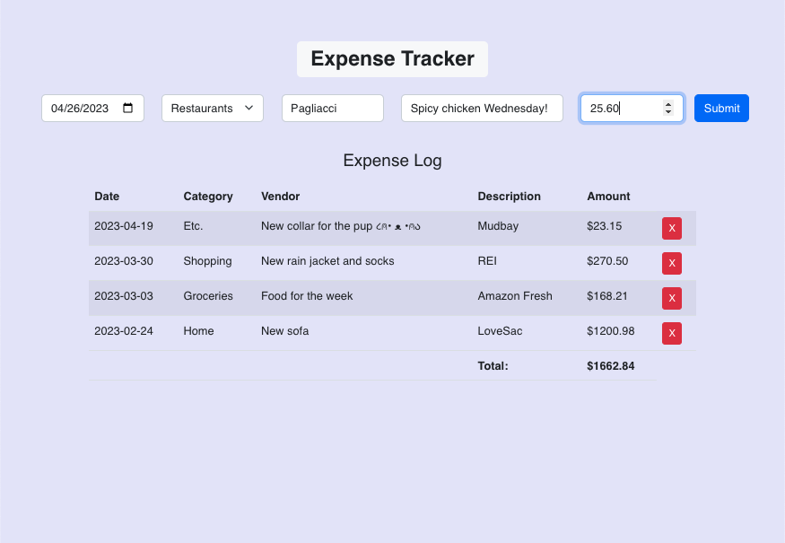

# Expense Tracker

 
Easily create, store, and refer your expenses using this Expense Tracker. With inputs for date, category, vendor, and description you can customize expenses to make them easier to reference.
 

[Click here to to use!](https://expense-tracker-natmsal.herokuapp.com/)

 

## Summary

This expense tracker was implemented using React, React-Bootstrap, Javascript and is deployed using Heroku. The tracker has 5 inputs: a date picker, a category dropdown selector, and three text inputs for vendor, description, and amount. When all 5 inputs have a value, the user can press "submit" and an expense line will be added to the "Expense Log" table below. The user can also click on any expense in the table, and it will be deleted. A total of the expenses input can be seen at the bottom of the table.

This app also utilizes local storage the expense items to prevent loss of expense information from navigating away from the page.

This project was a great way for me to familiarize myself with React using class components. I think learning using class components gave me a strong foundation of how the various levels of components interact with eachother thorugh props. This was also a great exercise in using the component file structure to simplify code readability and ultimately make it easier to edit in the future.
 

Author

- **Natalie Salazar** - Software Developer
